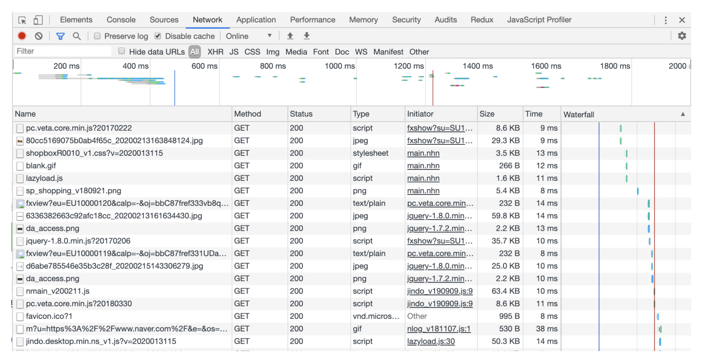
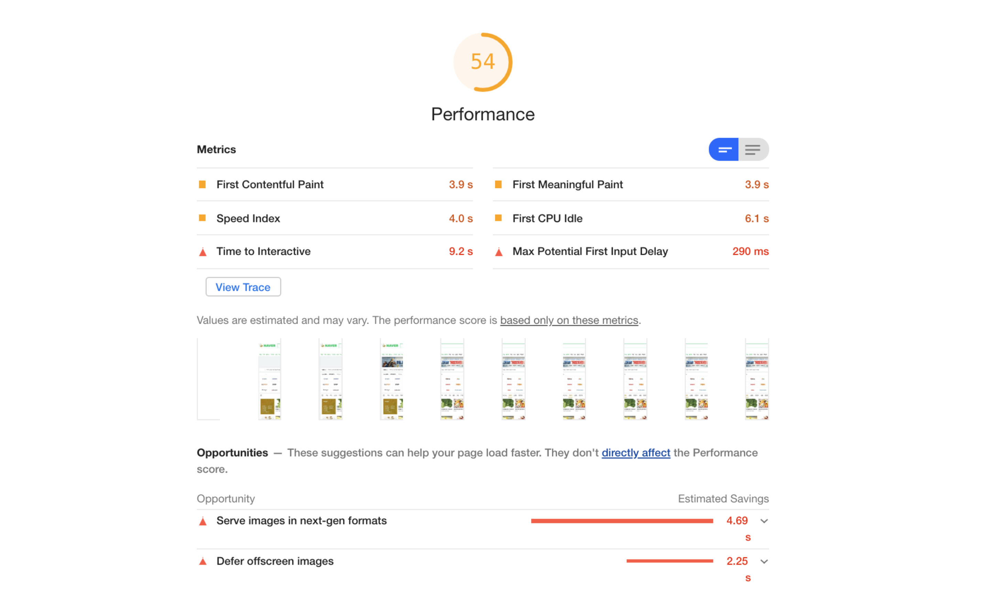
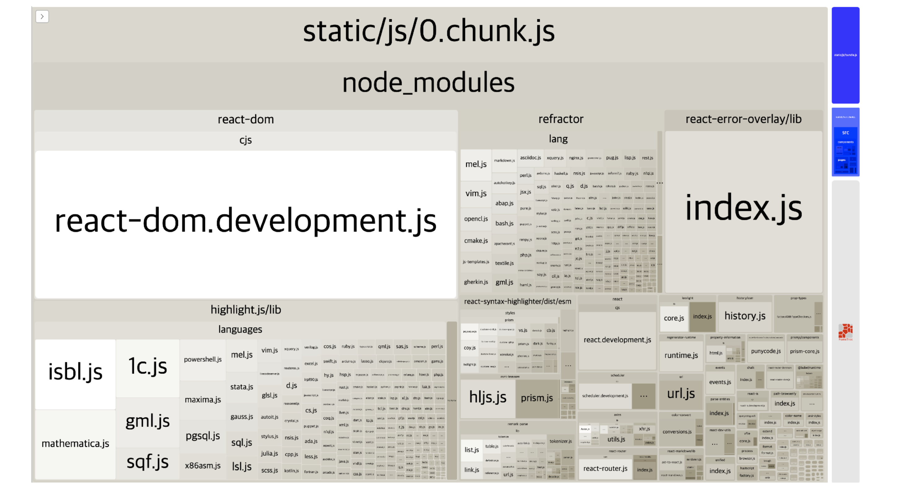
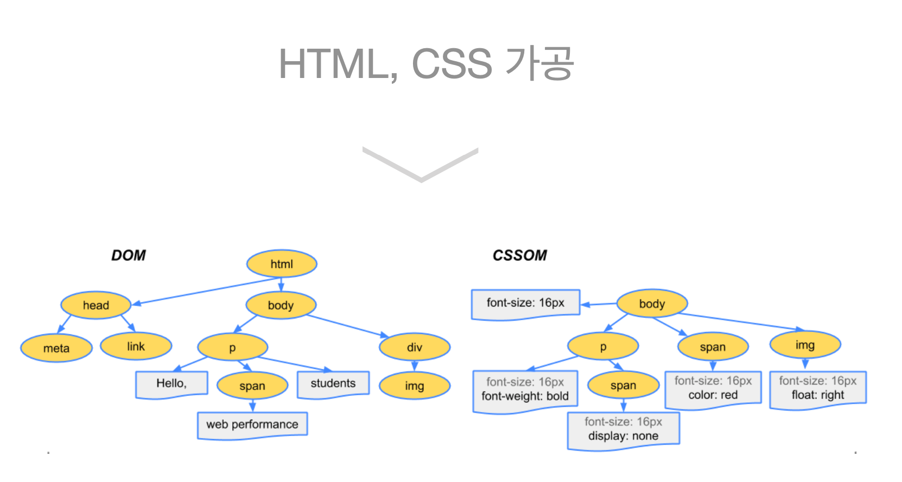
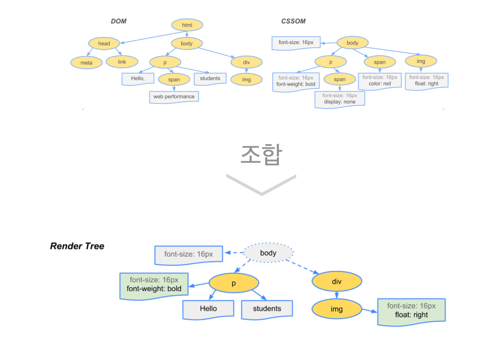
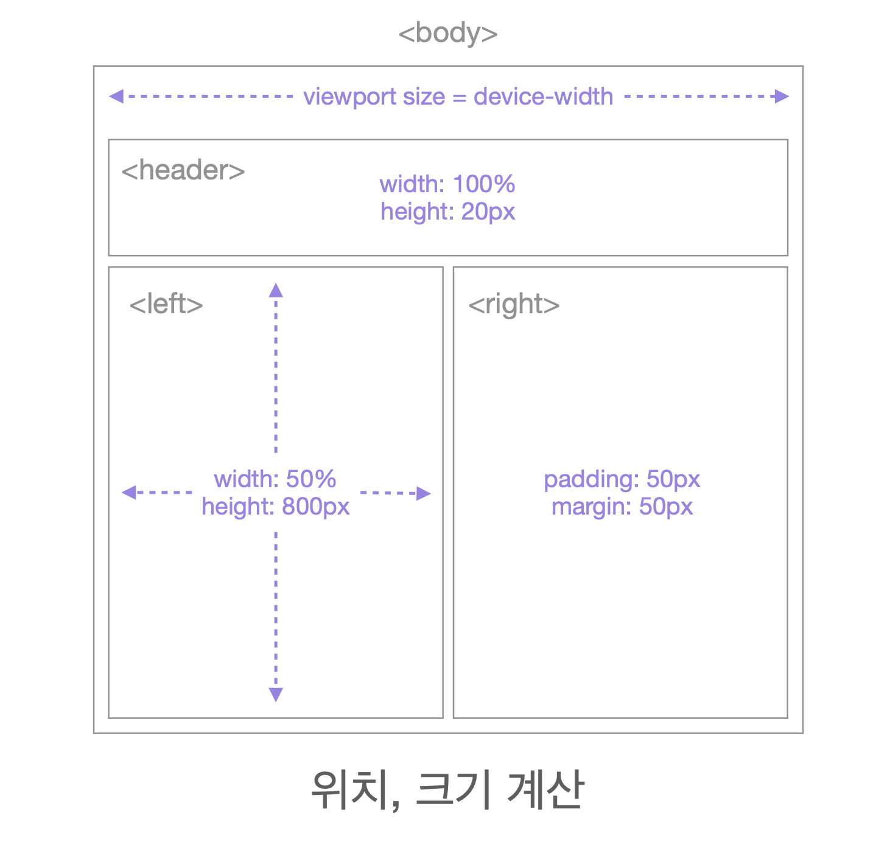
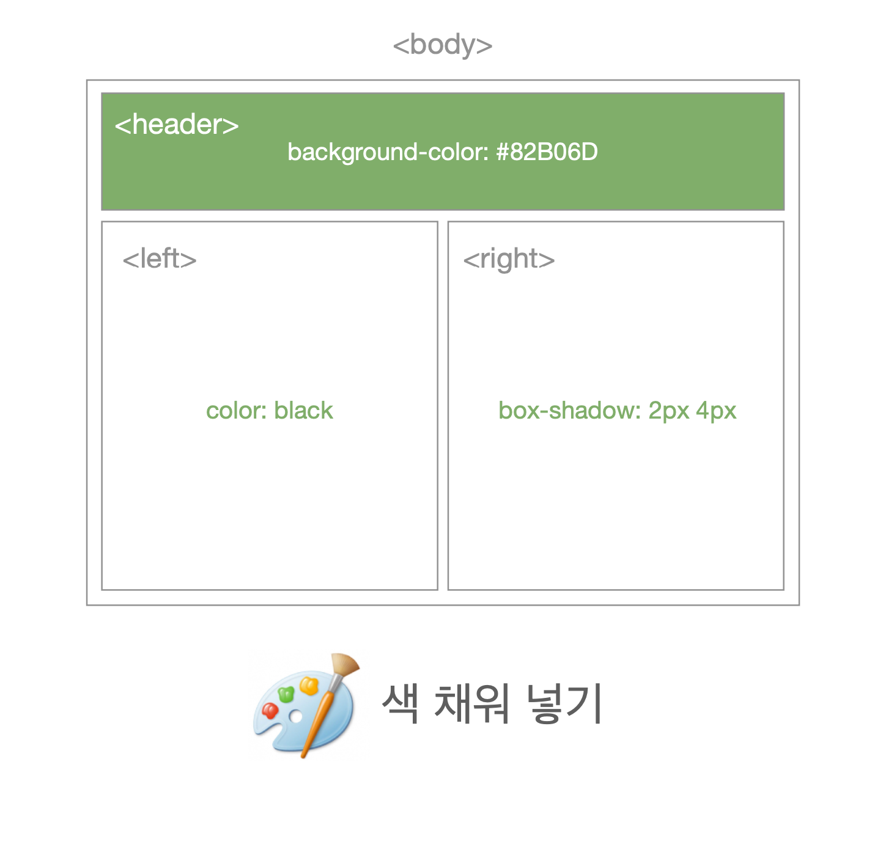

# 성능개선

## 1.성능 분석 TOOL

### 1) Network

--- 

### 2) performance

--- 

### 3) Light house

---

### 4) webpack-bundle-analyzer

--- 

## 2. 사전 지식 

### 1) 브라우저 랜더링 과정

`
HTML 파싱 > dom + cssom > render tree > Layout > paint> composite
`

#### 1-1) dom + cssom

---

#### 1-2) render tree 생성

---

#### 1-3) layout 

---

#### 1-4) paint 

---

#### 1-5) composite 

---

#### 1-6) 기타 주의해야할 사항
- html parsing 과정에서 DOM Tree 가 생성되도 CSSOM Tree 가 없으면 랜더링을 시작 하지 않는다. 
빠르게 CSSOM Tree 를 읽어와 랜더링을 완성 하기 위해서는 <head> 안에 CSS 파일을 넣어야 한다. 

- html parsing 과정에서 <head> 안에서 HTML/XML 파서가 script 파일을 만나게 되면 parsing을 멈추고 script 파일을 읽는다. script 파일을 읽는 동안 랜더링에 방해가 되어 무거운 스크립트가 실행될 때는 사용자 입장에서 웹페이지가 느리게 보인다. 

---

### 2) 성능지표 용어 정리 
- FP (First Paint) : 화면에 어떤 요소가 페인트 된 시점
- FCP (First Contentful Paint) : 화면에 이미지나 텍스트가 나타난 시점
- TTI (Time To Interactive) : 자바스크립트 초기 실행이 완료되고, 사용자가 인터렉션 할 수 있는 시점
- LCP (Largest Contentful Paint) : 최대 콘텐츠가 그려지는 시간 

