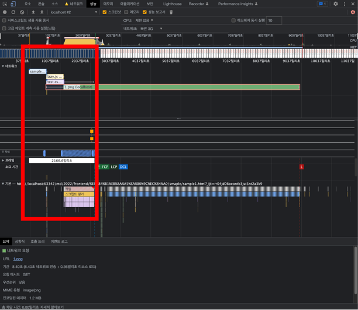
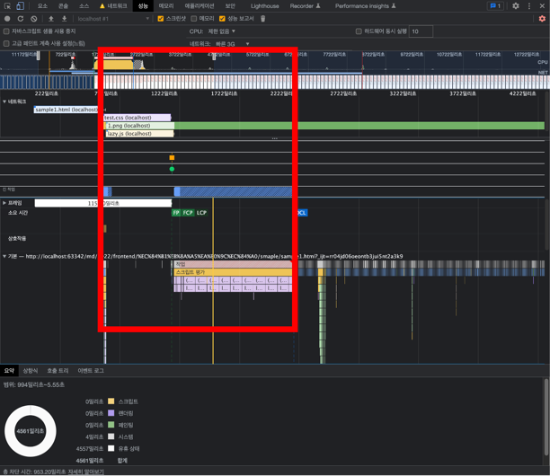

# 성능개선

## 1.성능 분석 TOOL

### 1) Network


--- 

### 2) performance


--- 

### 3) Light house


---

### 4) webpack-bundle-analyzer


--- 

## 2. 사전 지식 

### 1) 브라우저 랜더링 과정

`
HTML 파싱 > dom + cssom > render tree > Layout > paint> composite
`

#### 1-1) dom + cssom


---

#### 1-2) render tree 생성


---

#### 1-3) layout 


---

#### 1-4) paint 


---

#### 1-5) composite 


---

#### 1-6) 기타 주의해야할 사항
- html parsing 과정에서 DOM Tree 가 생성되도 CSSOM Tree 가 없으면 랜더링을 시작 하지 않는다. 
빠르게 CSSOM Tree 를 읽어와 랜더링을 완성 하기 위해서는 <head> 안에 CSS 파일을 넣어야 한다. 

- html parsing 과정에서 <head> 안에서 HTML/XML 파서가 script 파일을 만나게 되면 parsing을 멈추고 script 파일을 읽는다. script 파일을 읽는 동안 랜더링에 방해가 되어 무거운 스크립트가 실행될 때는 사용자 입장에서 웹페이지가 느리게 보인다. 

---

### 2) 성능지표 용어 정리 
- FP (First Paint) : 화면에 어떤 요소가 페인트 된 시점
- FCP (First Contentful Paint) : 화면에 이미지나 텍스트가 나타난 시점
- TTI (Time To Interactive) : 자바스크립트 초기 실행이 완료되고, 사용자가 인터렉션 할 수 있는 시점
- LCP (Largest Contentful Paint) : 최대 콘텐츠가 그려지는 시간 
- CLS (Cumulative Layout Shift) : 누적 레이아웃 이동 0~1 로 점수를 측정

---

#### 2-1) 라이트 하우스 성능 지표 비율 


---

## 3. 성능 개선 point

### 1) Block Time 줄이기
앞서 나온 내용 중 브라우저는 Dom tree 생성 중 script 태그를 만나면 script 태그를 평가한 후 다시 Dom tree 를 구성 하려고 한다. 

--- 
#### 1-1) 평가가 오래 걸리는 script를 head 태그 상단에 배치 
```html
<!DOCTYPE html>
<html lang="en">
<head>
    <meta charset="UTF-8">
    <title>Title</title>
    <script src="./js/lazy.js"> </script>
    <link rel="stylesheet" href="./css/test.css" />
</head>
<body>
<div>
    ...
    
</div>
</body>
</html>
```



스크립트 평가가 끝날 때 까지 css 파일의 꼬리가 길어지는 것을 볼 수 있다. 

그리고 또한 스크립트 평가가 끝이 난 후 화면에 FP 가 시작 된다.  

---
#### 1-2) 평가가 오래 걸리는 script를 body 태그 하단에 배치 

```html
<!DOCTYPE html>
<html lang="en">
<head>
    <meta charset="UTF-8">
    <title>Title</title>
    <link rel="stylesheet" href="./css/test.css" />
</head>
<body>
<div>
    
    <script src="./js/lazy.js"> </script>
</div>
</body>
</html>
```


위 그림과 같이 앞선 1-1 실험과 달리 css 꼬리가 사라진 것을 알 수 있고 cssom 이 끝났기 때문에 FP가 더 빨라지는 것을 볼 수 있다.


